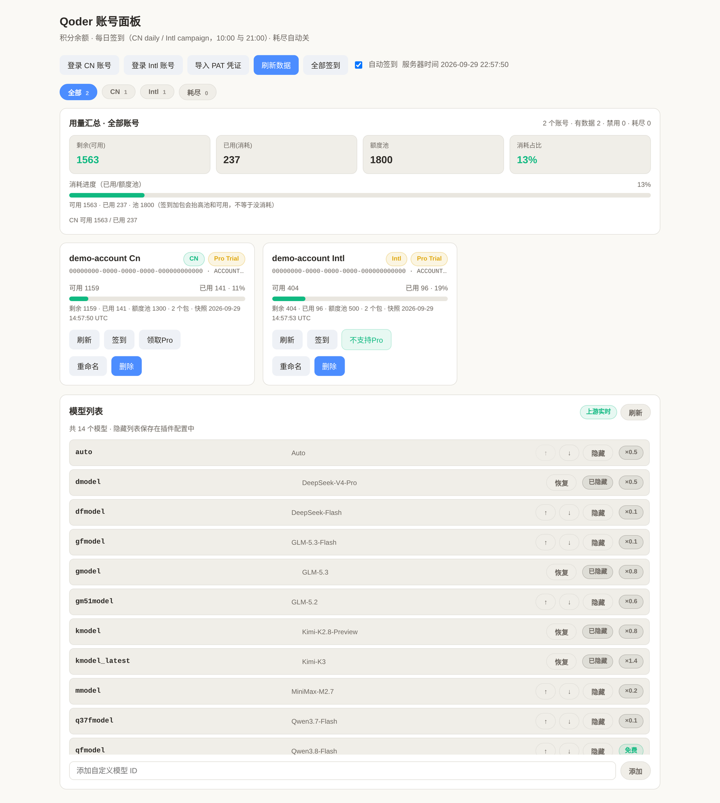

# qoder-cpa-plugin

[CLIProxyAPI (CPA)](https://github.com/router-for-me/CLIProxyAPI) 的 Qoder 插件。CN 与 Intl 合并为一个 provider，一个 `/v1/chat/completions` 接口即可调用 Qoder 全量模型。

[](LICENSE)
[](https://go.dev/)



## 功能

- **双区 OAuth / PAT 登录** — CN（`qoder.com.cn`）与 Intl（`qoder.com`）都支持设备码登录，也支持导入 PAT。一个账号一份 `qoder-<region>-<uid>.json` 认证文件，支持多账号并存。
- **模型目录** — 从 Qoder 网关实时拉取模型列表，按账号分别缓存（CN 与 Intl 各自返回不同的 key，互不串用）；面板可隐藏 / 恢复 / 排序 / 新增模型，点「刷新」会强制重新拉取上游而不是复用缓存。隐藏列表持久化在 `hidden_models`，并在 CPA 返回模型列表前生效。
- **签到** — CN 与 Intl 都走 campaign 权益领取（`GET /me/campaigns` + `/{campaignId}/claim`）；CN 的旧 `daily-check-in` 只作兼容兜底。每天 10:00 / 21:00 自动执行，也可在面板手动签到。
- **额度与生命周期** — 面板展示积分、套餐、签到状态；积分耗尽自动禁用 CN 账号，签到补回后自动恢复。
- **按模型冷却** — 单个模型触发限流时只冷却该 (账号, 模型) 组合，不冻结整个账号；面板可手动解除。
- **Token keepalive** — 定时刷新 access token，避免 Keycloak / device token 会话过期。
- **流式与工具调用** — COSY 签名的 OpenAI 兼容执行器，支持 SSE 流式输出与 tool calling。

## 安装

把编译好的 `qoder.so` 放进 CPA 的插件目录，然后在 `config.yaml` 启用：

```yaml
plugins:
  enabled: true
  dir: plugins
  configs:
    qoder:
      enabled: true
```

多平台部署时按 CPA 的平台子目录约定放置：

```
plugins/
  linux/amd64/qoder.so
  linux/arm64/qoder.so
  darwin/arm64/qoder.so
```

## 构建

```bash
# 当前平台
make -C plugins/qoder build

# 指定平台
./scripts/build.sh linux amd64
```

## 配置

全部字段可选，位于 `plugins.configs.qoder`：

```yaml
plugins:
  configs:
    qoder:
      enabled: true

      # 新增登录使用的区域：cn（默认）或 intl。已有账号保留各自区域。
      login_region: cn

      # 签到开关与调度（默认 true，10:00 / 21:00）
      checkin_auto: true

      # 积分耗尽自动禁用 / 恢复 CN 账号
      lifecycle_auto: true

      # 定时刷新 token
      token_keepalive: true

      # 插件维度的模型隐藏列表
      hidden_models:
        - some-model-id
```

## 面板

登录后打开 CPA 侧边栏的 Qoder 面板：

- 登录 / 导入账号，查看每个账号的区域、积分、套餐、签到状态
- 手动签到、领取 Pro 升级包
- 查看与解除模型维度的冷却
- 管理模型目录：隐藏 / 恢复 / 排序 / 新增

## 目录结构

| 路径 | 说明 |
|---|---|
| `plugins/qoder/` | 插件源码与嵌入式面板 |
| `scripts/build.sh` | 跨平台构建脚本 |
| `registry.json` | 插件注册元数据 |
| `docs/PROTOCOL.md` | 各平台协议事实清单（逆向整理） |

## Credits / 来源

本插件是在 [Sliverkiss](https://github.com/Sliverkiss) 的 `cpa-plugin`
（内含 `qoderwork` provider）基础上继续开发的 fork。插件当前由 **bfSan** 维护，覆盖原本的上游实现。

- **Sliverkiss** — 上游 `cpa-plugin` 的作者，最初把 QoderWork 接入 CPA；本插件的
  OAuth 流程、COSY 签名与执行器均源自其实现。
- **lovingfish** — 更早的 `qoderwork` 实现作者，Sliverkiss 的版本基于其工作。

> 说明：上游仓库 `Sliverkiss/cpa-plugin` 目前返回 404（已被作者删除或转为私有），
> 因此本 README 与插件元数据中的仓库地址均指向本 fork，不再指向已失效的上游链接。
> 原始署名保留在源码文件头与插件 `Author` 字段中。

## License

[MIT](LICENSE)，与上游一致。

